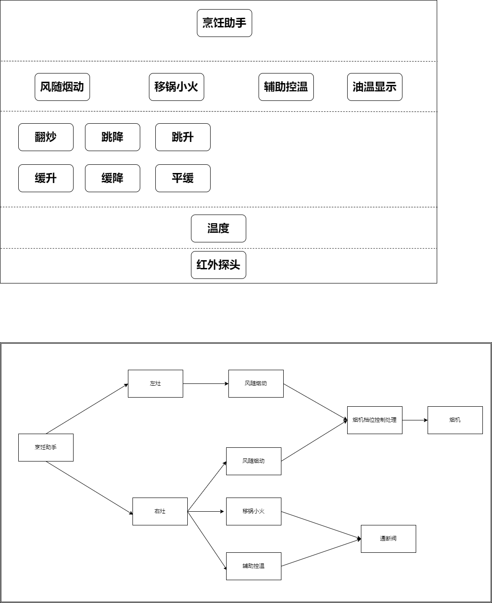

# X8GCZ 烹饪助手系统架构

[TOC]

## 整体架构

1. 系统整体包括：阿里云平台、通讯板、屏幕GUI、烹饪助手模块、电控板
2. 通讯板通过串口跟电控板交互，把当前状态通过屏幕UI显示，同时上报给云平台
3. 通讯板通过串口跟烹饪助手模块交互，控制烟机、灶具实现辅助烹饪

## 烹饪助手输入输出

## 烹饪助手架构

## 油温显示
1. 实时显示当前锅中的温度，辅助用户烹饪

## 智能排烟
1. 智能排烟主要根据红外探头采集的温度的变化特性，判断烹饪中的动作，从而调节用户想要的风速，达到智能排烟效果
2. 主要烹饪动作：翻炒、跳降、跳升、缓升、缓降、平缓

### 智能排烟状态图

1. 智能排烟的状态，可以互相转化
### 智能排烟详细逻辑图

### 智能排烟流程图

### 翻炒
1. 应用场景：烹饪中炒菜的场景
2. STATE=10组数据，数值变化穿过温度平均值，数值方向变化至少4次，平均温度大43度，温度最大差值大于6度
3. TIME1=8;TIME2=8;TIME3=12;TIME4=3;TIME5=3
4. GEAR1=3

### 跳降
1. 应用场景：烹饪时热锅中放入冷菜的场景
2. STATE=翻炒时幅度是35度，否则是15度，10组数据中连续的7组数据，前3组数据每个都比后3组数据大于幅度
3. TIME1=3;TIME2=3
4. GEAR1=3;GEAR2=1
5. TEMP1=130;TEMP2=80

### 跳升
1. 应用场景：烹饪中掀开锅盖的场景
2. STATE=1、翻炒时幅度是30度，否则是15度，10组数据中连续的7组数据，后3组数据每个都比前3组数据大于幅度;2、65度到100度之间平缓2秒，或缓升2秒，幅度是3度，10组数据中连续的6组数据，六组数据分为前三组后三组，后3组数据任意2组比前3组数据大于幅度
3. GEAR1=3;GEAR2=2
4. TEMP1=70;TEMP2=150
   

### 缓升
1. 应用场景：烹饪中开始热锅的场景
2. STATE=最新7组数据中，第1组小于最后1组1度以上小于20度以下，第1组小于等于第3组，第3组小于等于第6组，且第一组是最小值，最后一组是最大值。这个状态持续保持2秒数据
3. GEAR1=1;GEAR2=2
4. TEMP1=50;TEMP2=70;TEMP3=180

### 缓降
1. 应用场景：烹饪结束关火的场景
2. STATE=最新7组数据中，第1组大于最后1组1度以上大于10度以下，第1组大于等于第3组，第3组大于等于第6组。这个状态持续保持6秒数据
3. GEAR1=3;GEAR2=2;GEAR2=1
4. TEMP1=65

### 平缓
1. 应用场景：烹饪中炖食物的场景
2. STATE=1、烟机开启或者移锅小火，如果是移锅小火时，10组数据中，每组数据与平均值绝对值小于1度 ；否则10组数据中，每组数据与平均值绝对值小于1.5度;2、烟机开启且不是移锅小火，前5组数据平均值与后5组数据平均值的差绝对值小于1度
3. TIME1=5;TIME2=10
4. GEAR1=2;GEAR2=1
5. TEMP1=65;TEMP2=120

### 移锅小火
1. 应用场景：烹饪完成后拿走锅,火焰从大火转小火；放上锅，火焰从小火转大火
2. 移锅小火时，温度会快速上升，坐锅大火时，温度会快速下降
3. 通过温度变化特性判断可能是移锅小火状态，然后开小火，进行判断验证
4. 检测到温度跳降，验证成功则进入移锅小火，否则失败退出移锅小火
   

### 智能排烟烟机档位流程图
1. 烟机的切换存在最小的间隔TIME
2. 烟机的档位是取左右灶两者最大的档位
   

## 辅助控温
1. 当平均温度比目标值高于TEMP1度调小火，比目标值低于TEMP2度调大火
2. 火焰调整最小间隔TIME秒，防止频繁火焰变化
   

