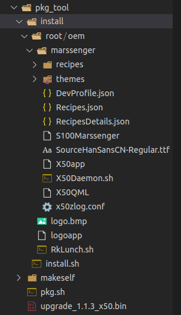

# X50BCZ
##目录介绍  
src：源码   
pkg_tool：升级包打包工具    
libhistory：烹饪历史库  
LinkSDK-MQTT5-CA：阿里云SDK4库  
liblinktool：编译完成的自定义工具库 
DevProfile.json：电控板和阿里云之间数据转换配置文件 
DevQuad.json：阿里云四元组  
Recipes.json：菜谱配置文件  
RecipesDetails.json：菜谱详情文件，UI程序使用   
x50_log.conf:zlog配置文件   
makefile：编译文件  
logo:上电启动时UI前会产生一段时间黑屏，为了解决这个，先运行这个程序显示logo 

###src目录
aliyun：阿里云交互代码
databse：数据库代码
device：设备相关代码，比如本机信息，售后信息
ota：ota通讯代码
uds：与UI进程通信代码
uart：电控板串口代码、手势串口代码
wifi：wifi代码
cloud_platform_task.c：电控板和阿里云之间数据转换代码
main.c:main主函数

##升级文件打包
###文件打包
./pkg_tool/pkg.sh
运行后会生成类似upgrade_1.1.2_x50.bin的升级固件
###升级目录介绍

intstall.sh：安装脚本，把升级包中文件复制进入设备
install：安装打包目录，**install/root**目录下路径和设备路径相同，需要升级的文件放入对应位置，升级时会把文件复制进相同目录
makeself:开源打包工具

##编译运行
###编译环境搭建
解压交叉编译工具链，并在~/.bashrc添加环境变量
export PATH=$PATH:~/host/bin 具体路径按实际情况
###编译命令
编译：make all
重新编译：make clean all
编译后生成可执行文件X50app
###运行程序
在X50app同级目录下添加如下文件
1、x50zlog.conf:zlog配置文件
2、Recipes.json：菜谱配置文件
3、DevProfile.json：电控板和阿里云之间数据转换配置文件
4、DevQuad.json：阿里云四元组（手动添加或四元组烧录服务器）
5、X50app:可执行文件