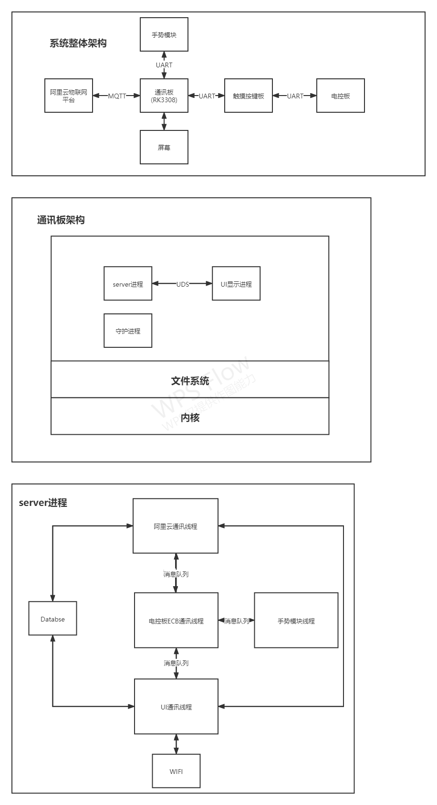
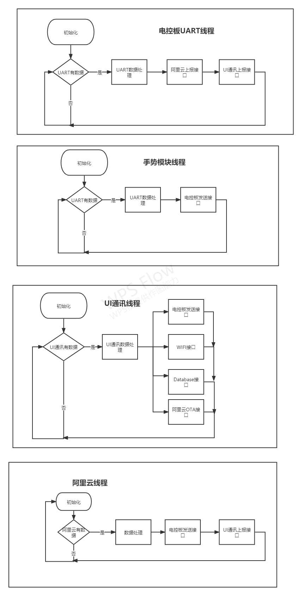

# X50系统详细架构

[TOC]

## 系统详细架构

1、系统整体包括：阿里云平台、通讯板、屏幕、手势模块、触摸按键板、电控板
2、通讯板控制屏幕显示，通过串口与手势模块、触摸按键板通讯
3、通讯板软件架构包括：server进程、UI显示进程、守护进程
4、server进程软件架构：阿里云通讯线程、手势模块线程、电控板通讯线程、UI通讯线程、WIFI接口、数据库接口
## 系统各个线程流程图

